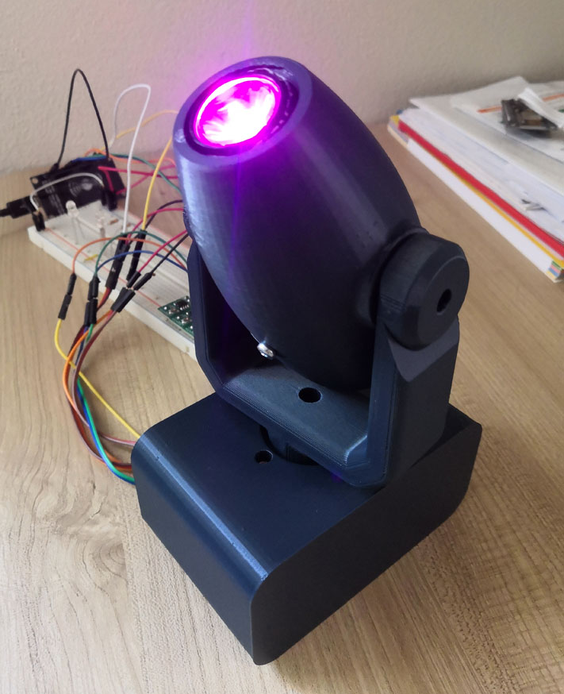

# Lobster 🦞 Mini Moving Head

This is a simple ArtNet node application for a 3D printed moving head using NodeMCU V3.

Watch it in action: https://youtube.com/shorts/YtfIU0vCi1o

3D printed using [this awesome model by Joel Brisson](https://www.thingiverse.com/thing:1912706).

This are the 8 DMX (over ArtNet) channels.
* R, G, B
* Intensity
* Strobe
* Pan
* Tilt
* Pan/Tilt speed

Developed using PlatformIO, target platform NodeMCU V3 (esp8266).

Connects using the following pins:
* D1: Pan (servo)
* D2: Tilt (servo)
* D5: R (pwm)
* D6: G (pwm)
* D7: B (pwm)

## License
Copyright &copy; 2023 Andrea Ghidini.

Lobster Mini Moving Head is [free software](https://www.gnu.org/philosophy/free-sw.html): you can redistribute it and/or modify
it under the terms of the [GNU General Public License](https://www.gnu.org/licenses/gpl-3.0.html) as published by
the [Free Software Foundation](https://www.fsf.org), either version 3 of the License, or
(at your option) any later version.

Lobster Mini Moving Head is distributed in the hope that it will be useful, but **WITHOUT ANY WARRANTY; without even the implied warranty of MERCHANTABILITY or FITNESS FOR A PARTICULAR PURPOSE**.
See the GNU General Public License for more details.

You should have received a [copy](LICENSE) of the GNU General Public License along with Lobster Mini Moving Head.
If not, see https://www.gnu.org/licenses/.

## Used libraries
* [hideakitai/ArtNet](https://github.com/hideakitai/ArtNet)
